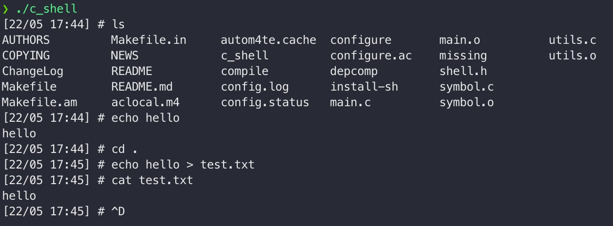

# C-Shell
A simple shell implemented in C, packaged using GNU autotools.


## Getting Started
```
autoreconf -i
./configure
make
./c_shell
```
## Supported Commands
- cd
- file output redirection >
- ls
- cat
- echo
- every program in $PATH

## Built With
- C
- autotools
